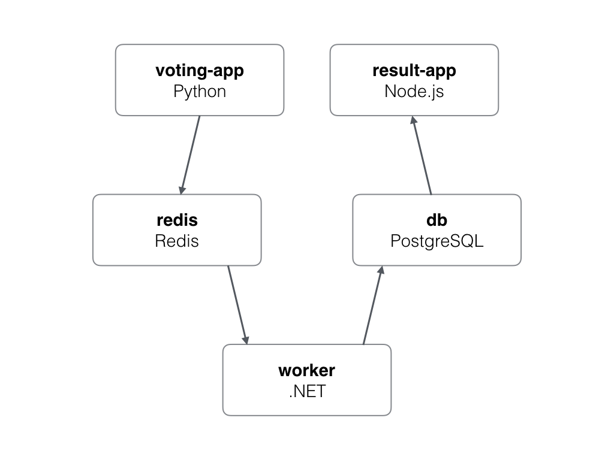
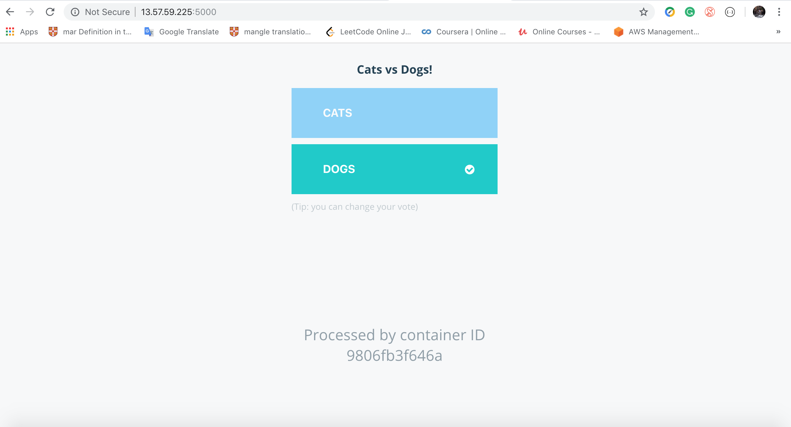
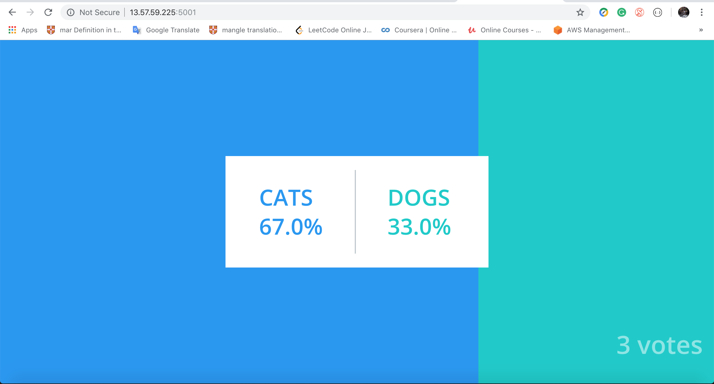

# Project
|number|content|folder|
|----|--------|-----|
|1|Basic git command|git|
|2|Vagrant with AWS|vagrant|
|3|Vagrant with AWS + docker|docker|
|4|Vagrant with AWS + docker swarm|swarm|
|5|Vagrant with AWS + kubernetes|kuber|
|6|AWS ECS + docker swarm|ecs-cli|

